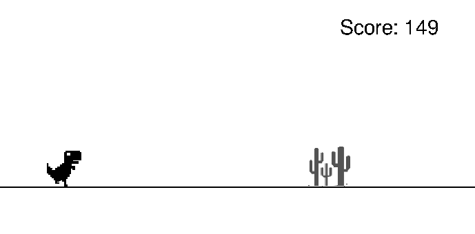

# Dino Runner (Pygame)

A lightweight, offline-friendly clone of the Chrome Dino game built with Pygame. Jump, slide, and dodge cacti and birds while racking up your score. Your best run is saved between sessions.

<!-- markdownlint-disable MD033 -->
<div align="center">
  
  <br/>
  <em>Gameplay screenshot</em>
</div>
<!-- markdownlint-enable MD033 -->

## Features

- Smooth 60 FPS gameplay with simple, responsive controls
- Obstacles: single/double/triple cacti and low-flying birds (with flapping animation)
- Jump and slide states with distinct animations
- Increasing challenge via randomized obstacle spacing
- Persistent high score (lightly obfuscated in `high_score.txt`)
- Keyboard and mouse input support

## Controls

- Jump: W or Up Arrow or Left Mouse Button
- Slide/Duck: S or Down Arrow or Right Mouse Button
- Restart after Game Over: Space
- Quit: Esc or window close button

## Requirements

- Python 3.8+
- Pygame 2.x

## Quick start

Run from the repo root (recommended to use a virtual environment):

```bash
# optional: create & activate a virtual environment
python3 -m venv .venv
source .venv/bin/activate

# install dependency
pip install pygame

# launch the game
python3 dino_runner.py
```

## How it works (quick tour)

- Game loop targets 60 FPS and handles input, physics, collisions, and rendering
- Obstacles recycle off-screen with randomized spacing; birds appear after you’ve warmed up
- Hitboxes are tuned to be fair for both cactus shapes and bird animations
- High score is saved to `assets/high_score.txt` using a simple reversible transform

## Troubleshooting

- No window opens / ImportError: Ensure Pygame is installed in the active environment: `pip show pygame`
- Black or white window only: Some remote/VM environments block hardware acceleration; try running locally
- High score not saving: Ensure the repo is writable and the game can create/update `assets/high_score.txt`

## Folder structure

```text
dino_runner_pygame/
  .gitignore         
  README.md           
  dino_runner.py       
  assets/              
    *.png              
    high_score.txt     
  screenshots/
    *.png               
```

## Credits

- Built with: [Pygame](https://www.pygame.org/)
- Code by me

## License

Free to use: This project is free to use for any purpose (personal or commercial). No warranty is provided. Attribution is appreciated but not required.
