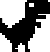

# Dino Runner (Pygame)

A lightweight, offline-friendly clone of the Chrome Dino game built with Pygame. Jump, slide, and dodge cacti and birds while racking up your score. Your best run is saved between sessions.

<div align="center">
  
  
  
</div>

## Features

- Smooth 60 FPS gameplay with simple, responsive controls
- Obstacles: single/double/triple cacti and low-flying birds (with flapping animation)
- Jump and slide states with distinct animations
- Increasing challenge via randomized obstacle spacing
- Persistent high score (lightly obfuscated in `high_score.txt`)
- Keyboard and mouse input support

## Controls

- Jump: W or Up Arrow or Left Mouse Button
- Slide/Duck: S or Down Arrow or Right Mouse Button
- Restart after Game Over: Space
- Quit: Esc or window close button

## Requirements

- Python 3.8+
- Pygame 2.x

## Installation

Use a virtual environment (recommended), then install dependencies.

```powershell
# From the repository root (Windows PowerShell)
python -m venv .venv
.\.venv\Scripts\Activate.ps1
pip install --upgrade pip
pip install pygame
```

## Run

```powershell
# From the repository root
python dino_runner_pygame\dino_runner\dino_runner.py
```

If you're using VS Code in this workspace, you can also run the predefined task:

- Terminal > Run Task… > "Run dino_runner"

## How it works (quick tour)

- Game loop targets 60 FPS and handles input, physics, collisions, and rendering
- Obstacles recycle off-screen with randomized spacing; birds appear after you’ve warmed up
- Hitboxes are tuned to be fair for both cactus shapes and bird animations
- High score is saved to `dino_runner/high_score.txt` using a simple reversible transform

## Troubleshooting

- No window opens / ImportError: Ensure Pygame is installed in the active environment: `pip show pygame`
- Black or white window only: Some remote/VM environments block hardware acceleration; try running locally
- High score not saving: Ensure the repo is writable and the game can create/update `dino_runner/high_score.txt`

## Folder structure

```
dino_runner_pygame/
  README.md            # This file
  dino_runner/
    dino_runner.py     # Game entry point
    *.png              # Sprites (dino, cacti, bird)
    high_score.txt     # Created/updated at runtime
```

## Credits

- Code and sprite assembly: repository author
- Built with: [Pygame](https://www.pygame.org/)

## License

No license file was found. If you intend to reuse or distribute, please add a license (e.g., MIT) to this repository.

